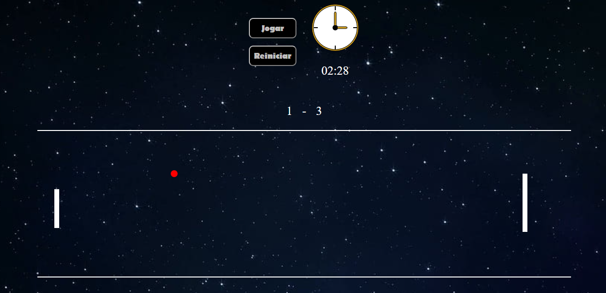

# Jogo No Canvas
<h1>Atividade de DJW - Canvas</h1>

<h2>Autores:</h2> Amanda e João Lucas

<h2>Elementos usados:</h2> HTML, Css, JavaScript

<h2>Andamento do projeto:</h2> Concluído

<h2>Descrição do projeto:<h2>

Este é um projeto de jogo no canvas, que tem como objetivo, representar de forma ilustrativa a música:

- [Legião Urbana - Tempo Perdido](https://www.youtube.com/watch?v=2hr7Uqu6G80)

Ela retratam temas como determinação, coragem, reforçam sempre como não devemos perder nosso tempo
com coisas fúteis ou desnecessárias e sempre evitar conflitos sem motivo. 
O jogo retrata esse temas de forma simplificada e tenta fazer o usuário refletir sobre estes temas ao jogar o jogo.
Jogo tem como objetivo representar o clássico jogo de ping-pong, onde o objetivo é ter uma pontuação, maior que a de seu adversário antes do tempo acabar, para vencer o jogo, divirta-se!

   
   - [Legião Urbana - Tempo Perdido]("video/canvas.mp4")

<h2>Instruções de Jogo:<h2> 

      
- [Pressione o botão Jogar na tela para começar o jogo]()
      
- [Pressione a Tecla W para movimentar a barra para cima]()
  
- [Pressione a Tecla S para movimentar a barra para baixo]()
  
- [Tente Rebater a Bola e marcar Pontos]()
  
- [Ao Terminar o Tempo, Saia ou Clique em Reiniciar para jogar novamente]()
  

